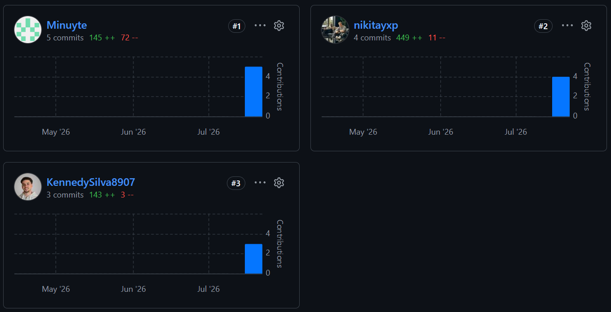
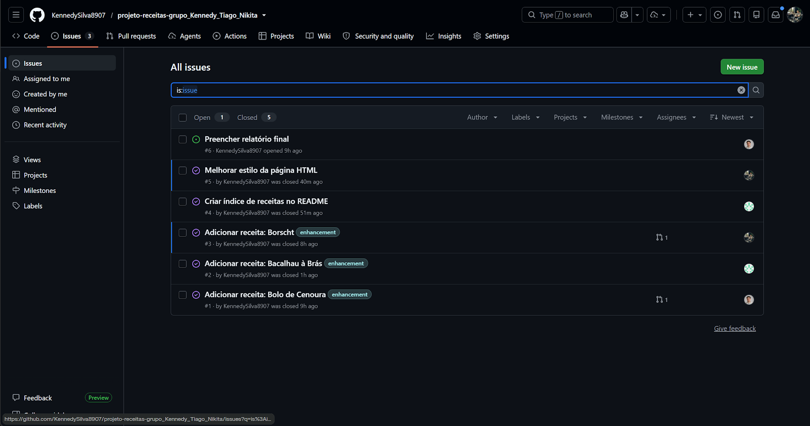
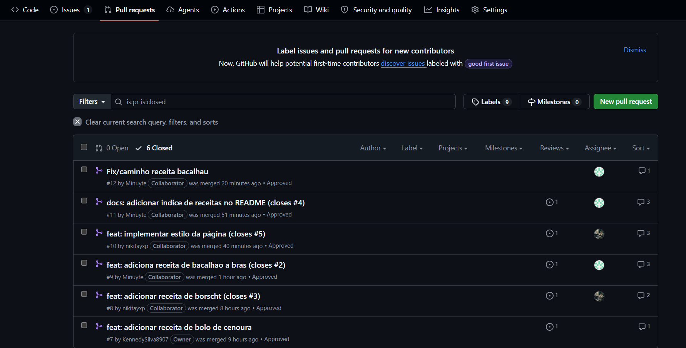

# Relatório Final - Página Colaborativa de Receitas

## Integrantes do Grupo
- **Nome do projeto:** Página Colaborativa de Receitas
- **Integrantes:**
  - Kennedy Silva (@KennedySilva8907) — owner do repositório
  - Tiago Silva (@Minuyte)
  - Nikita Slobodeniuc (@nikitayxp)
- **Repositório:** https://github.com/KennedySilva8907/projeto-receitas-grupo_Kennedy_Tiago_Nikita

## Branches Criadas

O repositório foi criado a partir do template do professor. A branch `main` foi protegida
através de um *ruleset* com as regras "Require a pull request before merging" (mínimo de 1
aprovação) e "Restrict deletions". Isto impediu qualquer commit direto na main e obrigou todo
o trabalho a passar por pull request revisto por outra pessoa.

| Branch | Objetivo | Autor |
|---|---|---|
| `feature/bolo-de-cenoura` | Adicionar a receita de bolo de cenoura | Kennedy |
| `feature/adicionar-receita-borscht` | Adicionar a receita de borscht | Nikita |
| `feature/receita-bacalhau-a-bras` | Adicionar a receita de bacalhau à brás | Tiago |
| `feature/indice-readme` | Criar o índice de receitas no README | Tiago |
| `feature/melhorar-estilo-da-pagina-html` | Estilizar a página `src/index.html` | Nikita |
| `fix/caminho-receita-bacalhau` | Corrigir o nome do ficheiro da receita de bacalhau | Tiago |
| `docs/relatorio-final` | Escrever este relatório | Kennedy |

Todos os merges foram feitos através de pull request na interface do GitHub, com aprovação
obrigatória de outro elemento do grupo. Nenhum merge foi feito diretamente por linha de
comandos sobre a main.

## Histórico de Commits

Seguimos a convenção indicada no `CONTRIBUTING.md` do repositório, no formato
`tipo: descrição`, usando `feat` para funcionalidades novas, `docs` para documentação e `fix`
para correções. Exemplos reais do nosso histórico:

- `feat: adicionar receita de bolo de cenoura (closes #1)`
- `feat: estruturar cabeçalhos da receita de borscht (closes #3)`
- `fix: corrigir formatação do markdown na receita (closes #3)`
- `docs: adicionar indice de receitas no README (closes #4)`
- `fix: corrigir nome do ficheiro da receita de bacalhau a bras`

Usámos `closes #N` nas mensagens de commit para que a issue correspondente fechasse
automaticamente no merge, mantendo a ligação entre cada commit e a tarefa que lhe deu origem.

O histórico do projeto pode ser visualizado com `git log --all --oneline --graph --decorate`,
onde é visível a estrutura em que cada branch parte da main, recebe os seus commits, e volta a
juntar-se através de um merge commit de pull request.

## Issues Criadas

As issues foram criadas no início do projeto e atribuídas antes de qualquer código ser
escrito, para que cada elemento soubesse exatamente qual era o seu âmbito de trabalho e não
houvesse sobreposição.

| Issue | Descrição | Responsável |
|---|---|---|
| #1 | Adicionar receita: Bolo de Cenoura | Kennedy |
| #2 | Adicionar receita: Bacalhau à Brás | Tiago |
| #3 | Adicionar receita: Borscht | Nikita |
| #4 | Criar índice de receitas no README | Tiago |
| #5 | Melhorar estilo da página HTML | Nikita |
| #6 | Preencher relatório final | Kennedy |

Utilizámos ainda labels para categorizar as issues (por exemplo, `enhancement` nas
tarefas de novas receitas), facilitando a leitura do quadro de trabalho.

## Pull Requests

Foram abertos sete pull requests, todos com aprovação de outro elemento do grupo
antes do merge. O último (#13) é o que integra este próprio relatório.

| PR | Título | Autor |
|---|---|---|
| #7 | feat: adicionar receita de bolo de cenoura | Kennedy |
| #8 | feat: adicionar receita de borscht (closes #3) | Nikita |
| #9 | feat: adiciona receita de bacalhao a bras (closes #2) | Tiago |
| #11 | docs: adicionar indice de receitas no README (closes #4) | Tiago |
| #10 | feat: implementar estilo da página (closes #5) | Nikita |
| #12 | Fix/caminho receita bacalhau | Tiago |
| #13 | docs: preencher relatorio final (closes #6) | Kennedy |

O processo de revisão não foi meramente formal. Em dois casos foram pedidas alterações antes
da aprovação, usando a opção **Request changes** do GitHub:

- No PR #11, foi pedido ao autor que acrescentasse um emoji a cada receita listada no índice.
  A alteração foi feita e submetida como um novo commit na mesma branch
  (`docs: adicionar emojis ao indice de receitas`), sendo automaticamente incorporada no pull
  request já aberto — sem necessidade de criar um PR novo.
- No PR #10, foi detetado um commit com a mensagem fora da convenção do `CONTRIBUTING.md`, e
  foi pedida a correção antes da aprovação.

Isto mostrou-nos que um pull request não é um passo burocrático: é o momento em que o trabalho
é efetivamente verificado por outra pessoa antes de entrar na main.

## Conflitos e Resoluções

Não ocorreram conflitos de merge durante o projeto. Isso não foi acaso: resultou da forma como
dividimos o trabalho. Cada receita ficou num ficheiro separado dentro de `src/`, e as tarefas
que tocavam em ficheiros partilhados — o `README.md` e o `src/index.html` — foram atribuídas a
pessoas diferentes e executadas em momentos diferentes, já depois das receitas estarem
integradas na main.

A regra que aplicámos foi correr sempre `git checkout main` seguido de `git pull` antes de
criar uma branch nova, para partir sempre da versão mais recente do projeto. Quando duas
branches partem de pontos diferentes do histórico e alteram as mesmas linhas do mesmo ficheiro,
o conflito é praticamente garantido — foi exatamente essa situação que evitámos.

Percebemos, no entanto, como um conflito surgiria e como se resolve: se dois de nós tivessem
editado a mesma secção do `README.md` em paralelo, o segundo merge apresentaria os marcadores
`<<<<<<<`, `=======` e `>>>>>>>` no ficheiro. A resolução passaria por editar manualmente essa
zona, apagar os marcadores, decidir qual o conteúdo final, e concluir com `git add` seguido de
`git commit`.

Houve, ainda assim, um episódio próximo disso: o mesmo problema — o link partido da receita de
bacalhau no README — acabou por ser corrigido em duplicado, por duas pessoas em branches
diferentes (commits `23b20db` e `162959b`, ambos com a mesma mensagem). A causa foi um clone
local desatualizado, em que a correção já integrada na main ainda não estava visível. Não gerou
conflito porque as alterações eram idênticas, mas mostrou-nos na prática porque é que o
`git pull` antes de começar qualquer tarefa não é opcional.

## Dificuldades Enfrentadas

**Commits feitos na branch errada.** Aconteceu mais do que uma vez alguém editar ficheiros sem
antes ter criado a branch com `git checkout -b`, ficando o commit na `main` local. O push
falhava com o erro `src refspec ... does not match any`. A solução foi criar a branch a apontar
para o commit já existente com `git branch <nome>`, repor a main local com
`git reset --hard origin/main`, e só depois mudar para a branch e fazer push. Nada se perdeu,
mas obrigou-nos a perceber que uma branch em Git é apenas um apontador para um commit — e não
uma cópia dos ficheiros, como assumíamos no início.

**Esquecer o `git add`.** Editar e gravar o ficheiro no VS Code não é suficiente: o Git só
regista o que foi explicitamente adicionado à *staging area*. Várias vezes o `git commit`
devolveu "nothing added to commit" ou deixou alterações por guardar sem darmos por isso.
Passámos a correr `git status` entre cada passo para confirmar o estado antes de avançar.

**Ficheiro criado fora da pasta correta.** Numa das receitas o ficheiro foi criado na raiz do
repositório em vez de `src/`, e o `git add src/ficheiro.md` falhou com `pathspec did not match
any files`.

**Nome de ficheiro fora da convenção, e a referência que ficou para trás.** A receita de
bacalhau foi inicialmente commitada como `src/receita_bacalhau_a_bras.md`, mas o índice do
README apontava para `src/bacalhau-a-bras.md`, deixando o link partido. Como já tinha sido
feito merge, a correção foi feita numa branch nova (`fix/caminho-receita-bacalhau`) com
`git mv`, que o Git regista como um *rename* em vez de uma remoção seguida de uma criação,
preservando o histórico do ficheiro. A lição aqui foi que mudar o nome de um ficheiro não é uma
operação isolada: obriga a atualizar tudo o que lhe faz referência.

**Bloqueio à espera de aprovação.** Como o ruleset exige uma aprovação e ninguém pode aprovar o
seu próprio pull request, houve momentos de espera. Isto tornou claro que a revisão é um
compromisso do grupo: quem recebe um pedido de review tem de responder no mesmo dia, ou toda a
gente fica parada.

## Principais Comandos Git Utilizados

| Comando | Para que serviu |
|---|---|
| `git clone <url>` | Trazer o repositório do GitHub para o computador |
| `git checkout -b <branch>` | Criar uma branch nova e mudar para ela ao mesmo tempo |
| `git checkout main` + `git pull` | Atualizar a main local antes de começar uma tarefa nova |
| `git status` | Verificar em que branch estamos e o que está por guardar — o comando que mais usámos |
| `git add <ficheiro>` | Marcar as alterações para entrarem no próximo commit |
| `git commit -m "tipo: descrição"` | Registar as alterações no histórico |
| `git push -u origin <branch>` | Enviar a branch para o GitHub pela primeira vez e ligá-la à remota |
| `git push` | Enviar commits seguintes de uma branch já ligada |
| `git log --all --oneline --graph --decorate` | Ver o histórico completo em gráfico, com todas as branches e merges |
| `git branch` / `git branch -a` | Listar as branches locais e remotas |
| `git mv <antigo> <novo>` | Mudar o nome de um ficheiro preservando o seu histórico |
| `git fetch origin` | Obter informação do remoto sem alterar os ficheiros locais |
| `git reset --hard origin/main` | Repor a main local igual à do GitHub, após um commit no sítio errado |
| `git commit --amend` | Corrigir a mensagem do último commit |

## Conclusão

O maior aprendizado deste trabalho não foi decorar comandos, mas perceber que o Git resolve um
problema de coordenação entre pessoas. Foi possível trabalharmos os três em paralelo, no mesmo
projeto e ao mesmo tempo, sem nos pisarmos — algo impraticável se estivéssemos a trocar
ficheiros entre nós.

Aprendemos também que a maior parte dos erros em Git não são graves nem irreversíveis. Todos os
problemas que tivemos — commits na branch errada, ficheiros no sítio errado, alterações não
adicionadas, trabalho duplicado — foram recuperáveis sem perder nada. O que evitou situações
mais complicadas foi o hábito de correr `git status` antes de cada passo, em vez de encadear
comandos às cegas.

Por fim, a organização à volta do código revelou-se tão importante como o código em si. Ter as
issues criadas e atribuídas antes de começar, ter a main protegida e obrigar a revisão de outra
pessoa fez com que ninguém trabalhasse fora do seu âmbito nem entrasse na main trabalho por
verificar. É uma forma de trabalhar que faz sentido levar para projetos futuros.

